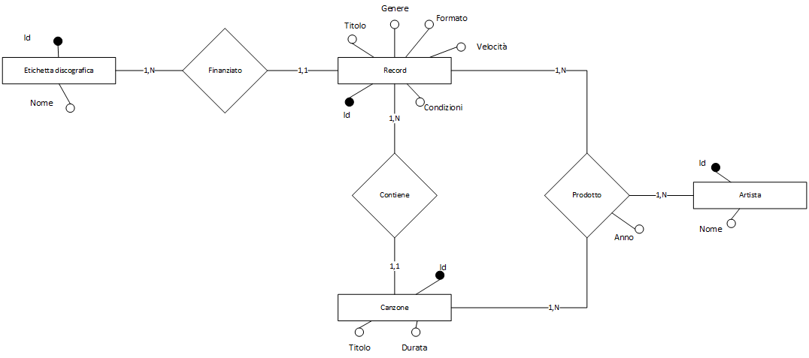

# Vinyl Collection

Sito web per la gestione della propria collezione di vinili realizzato come progetto conclusivo del corso di Basi di Dati e Web dell'Università degli studi di Parma tenuto dal professor S.Cagnoni. Il sito è stato realizzato in linguaggio **PHP** e utilizza un server **MySQL** gestito tramite phpMyAdmin presente in locale per la gestione dei dati.

Il sito vuole gestire una base dati contenente i dati relativi alla propria **collezione di dischi in vinile**. Nel sito è possibile vedere tutti i vinili presenti nella collezione, cercarli per artista, titolo, anno di uscita e per canzoni presenti nel disco. È possibile anche inserire nuovi vinili e modificare i dati di quelli già presenti.

## Architettura

Il sito è composto da 3 pagine principali:

- `index.php`: pagina principale del sito, contiene un form per la **ricerca** dei vinili, un link per l'accesso alla pagina di **inserimento** di un nuovo vinile e la visualizzazione di tutto il catalogo. Per effettuare una ricerca occorre inserire nel campo del form il titolo dell'album, l'artista, l'anno di pubblicazione o il nome di una canzone; se non viene inserito nulla, verranno mostrati tutti i vinili presenti nella collezione. Essendo la collezione molto ampia, la visualizzazione della lista dei vinili è **paginata** e ogni pagina mostra 10 vinili alla volta. Ogni vinile presente nella lista è un link che porta alla pagina di **dettaglio** del vinile. La pagina è mossa da due parametri:

  - `click`: **numero della pagina da visualizzare**, se non viene specificato nessun parametro, viene mostrata la prima pagina con i primi 10 dischi. Viene anche usato per la navigazione tra le pagine.
  - `param`: **parametro di ricerca**, se non viene specificato nessun parametro, viene mostrata la lista completa dei vinili.
  - `order`: **parametro per l'ordinamento dei risultati proposti**. Se 0, il catalogo viene ordinato per titolo, se 1, il catalogo viene ordinato per artista, se 2, il catalogo viene ordinato per anno di pubblicazione.

- `record.php`: pagina che mostra i **dettagli** di un vinile, permette di **modificarne i dati** e di **cancellarlo**. Per ogni vinile vengono mostrati il titolo dell'album, l'artista, l'anno di pubblicazione, il genere, il formato del disco (12", 10", 7"), la velocità di riproduzione (33, 45, 78), e le condizioni del disco e della copertina secondo le specifiche di [Discogs](https://support.discogs.com/hc/en-us/articles/360001566193-How-To-Grade-Items) ed eventuali note inserite in fase di registrazione del disco; sotto i dettagli del vinile, se presenti, vengono inserite le canzoni presenti nel disco. Per ogni canzone viene mostrato il titolo e la durata.
  
  Per modificare i dati del vinile occorre cliccare sul pulsante "Modifica" presente in fondo alla pagina mentre per cancellare il vinile occorre cliccare sul pulsante "Cancella". La modifica del disco permette di inserire tutti i dati mancanti e modificare quelli già presenti; in questa fase, qualora non è stato indicato il numero delle tracce, è possibile inserirne il numero per poi passare alla pagina di inserimento delle canzoni `add-songs.php`. Quando si modifica il il numero delle tracce, se viene inserito un nuovemo maggiore di quello precedente, verranno aggiunte le canzoni mancanti, se invece viene inserito un numero minore, verranno eliminate tutte le canzoni presenti e si dovranno inserire nuovamente tutte e canzoni.

  > <u>La cancellazione del vinile è una operazione irreversibile</u>, una volta confermata la cancellazione, il vinile verrà eliminato dal database e non sarà più possibile recuperarlo. Verranno rimosse anche le canzoni associate al vinile.

  Per poter visualizzare i dettagli di un vinile è necessario passare come parametro l'id del vinile.

- `add-record.php`: pagina che permette di **inserire un nuovo vinile**. Per ogni disco è possibile inserire il titolo, l'artista, l'anno di pubblicazione, il genere, il formato del disco (12", 10", 7"), la velocità di riproduzione (33, 45, 78), e le condizioni del disco e della copertina secondo le specifiche di [Discogs](https://support.discogs.com/hc/en-us/articles/360001566193-How-To-Grade-Items). Per ogni canzone è possibile inserire il titolo e la durata. Per inserire le canzoni occorre cliccare sul pulsante "Aggiungi canzoni" presente in fondo alla pagina, verrà aperta una nuova pagina `add-songs.php` che permette di inserire i dati di ogni singola canzone.

Gli altri file presenti nella cartella principale sono:

- `database-connection.php`: file che contiene le credenziali per la connessione al database e la funzione per la connessione al database.
- `functions.php`: file che contiene tutte le funzioni e query utilizzate nel sito.
- `index-functions.php`: file che contiene le funzioni impiegate nella pagina principale per la modifica del titolo della pagina, per la gestione della ricerca e degli ordinamenti.
- `lastfm-api.php`: file che contiene la funzione per la ricerca di un artista su Last.fm e la funzione per la ricerca di un album su Last.fm.
- `modify-record.php` e `modify-songs.php`: pagine per la modifica del disco e per la modifica delle canzoni (ricalcano le pagine `add-record.php` e `add-songs.php` rispettivamente)
- `delete-record.php`: file che contiene la funzione per la cancellazione di un vinile e delle canzoni associate al vinile.
- `header.php`: file che contiene il codice per la creazione dell'header della pagina.
- `footer.php`: file che contiene il codice per la creazione del footer.

Per ottenere la foto degli artisti e gli artwork si utilizza l'API di Last.fm (occorre inserire la propria API key nel file `lastfm-api.php` accanto ad ogni url delle richieste). La parte grafica è stata realizzata utilizzando il framework [Tailwind CSS](https://tailwindcss.com/).

## Database

Il database contiene le informazioni relative al singolo disco, dell'artista, delle canzoni e delle etichette discografiche. Il database è composto da 4 tabelle:

- `records`: contiene i dati relativi al disco. Ogni disco è caratterizzato da un identificativo, il titolo, l'artista, l'anno di pubblicazione, il genere, il formato del disco (12", 10", 7"), la velocità di riproduzione (33, 45, 78), e le condizioni del disco e della copertina, la casa discografica, e il numero di tracce presenti nel disco. Contiene anche un campo per l'inserimento delle note personali riguardanti il disco. Per ogni disco è possibile inserire un solo artista e una sola etichetta discografica, ma deve prevedere che vi siano più canzoni associate. Ogni disco deve necessariamente contenere un identificativo, un titolo e un artista; tutti gli altri campi possono essere lasciati vuoti e riempiti in seguito.
- `artists`: contiene i dati relativi all'artista. Ogni artista è caratterizzato da un identificativo e da un nome. Ogni artista deve necessariamente contenere un identificativo e un nome.
- `songs`: contiene i dati relativi alle canzoni. Ogni canzone è caratterizzata da un identificativo, il titolo, la durata e l'identificativo del disco a cui è associata e l'identificativo dell'artista.
- `labels`: contiene i dati relativi alle etichette discografiche. Ogni etichetta discografica è caratterizzata da un identificativo e da un nome.

Un possibile schema è il seguente:



L'attributo "condizione" presente nell'entità "record" può essere scorporato in due sotto-attributi che rappresentano la condizione del disco e della copertina. Questa scelta è stata fatta per facilitare la descrizione del disco in maggiore dettaglio.

### Schema logico

Lo schema logico del database è il seguente:

$$
\begin{align*}
&\textbf{Record}(\underline{id}, titolo, idArtista, genere, formato, velocità, condizioneDisco, condizioneCopertina, idEtichetta, note, numeroTracce)\\
&\textbf{Artista}(\underline{id}, nome)\\
&\textbf{Canzone}(\underline{id}, titolo, durata, idRecord, idArtista)\\
&\textbf{Etichetta}(\underline{id}, nome)\\
&\textbf{Prodotto}(idArtista, idCanzone, idRecord)\\
&\textbf{Contiene}(idCanzone, idRecord)\\
&\textbf{Finanziato}(idRecord, idEtichetta)\\
\end{align*}
$$

### Schema fisico

Lo schema fisico del database, da ricreare poi nel software di gestione del database MySQL, è il seguente:

```sql
CREATE TABLE `artists` (
  `id` int(11) NOT NULL AUTO_INCREMENT,
  `name` varchar(255) NOT NULL,
  PRIMARY KEY (`id`)
) ENGINE=InnoDB DEFAULT CHARSET=utf8mb4;

CREATE TABLE `labels` (
  `id` int(11) NOT NULL AUTO_INCREMENT,
  `name` varchar(255) NOT NULL,
  PRIMARY KEY (`id`)
) ENGINE=InnoDB DEFAULT CHARSET=utf8mb4;

CREATE TABLE `records` (
  `id` int(11) NOT NULL AUTO_INCREMENT,
  `title` varchar(255) NOT NULL,
  `artist` int(11) NOT NULL,
  `label` int(11) DEFAULT NULL,
  `year` int(11) DEFAULT NULL,
  `insert_date` datetime DEFAULT current_timestamp(),
  `vinyl_condition` varchar(3) DEFAULT NULL,
  `sleeve_condition` varchar(3) DEFAULT NULL,
  `format` int(2) DEFAULT NULL,
  `speed` int(2) DEFAULT NULL,
  `notes` text DEFAULT NULL,
  `genre` varchar(256) NOT NULL,
  `numberOfSongs` int(11) NOT NULL,
  PRIMARY KEY (`id`),
  FOREIGN KEY (`artist`) REFERENCES `artists` (`id`),
  FOREIGN KEY (`label`) REFERENCES `labels` (`id`)
) ENGINE=InnoDB DEFAULT CHARSET=utf8mb4;

CREATE TABLE `songs` (
  `id` int(11) NOT NULL AUTO_INCREMENT,
  `title` varchar(255) NOT NULL,
  `artist` int(11) NOT NULL,
  `duration` varchar(11) DEFAULT NULL,
  `records` int(11) DEFAULT NULL,
  PRIMARY KEY (`id`),
  FOREIGN KEY (`artist`) REFERENCES `artists` (`id`),
  FOREIGN KEY (`records`) REFERENCES `records` (`id`)
) ENGINE=InnoDB DEFAULT CHARSET=utf8mb4;
```

Per semplificare la gestione del database, è stato creato un file `database.sql` che contiene tutti i comandi per creare il database e le tabelle. Il file è presente nella cartella `database` del progetto. Se si vuole invece utilizzare un sistema che contiene già dei dati, si può utilizzare il file `myvinylcollection.sql` che contiene i dati di esempio.

## Installazione

Per installare il progetto è necessario avviare un server web e un server MySQL. Per avviare il server web e MySQL è possibile utilizzare [XAMPP](https://www.apachefriends.org/it/index.html). Una volta avviato il server, è necessario creare un database e importare il file `database.sql` presente nella cartella `database` del progetto. Per importare il database è necessario utilizzare il comando

```shell
mysql -u username -p database_name < database.sql
```

da terminale. Una volta importato il database, è necessario modificare il file `database-connection.php` presente nella cartella principale del progetto, inserendo le credenziali per la connessione al database e il nome della tabella creata.

Per poter utilizzare la funzione di ricerca di un artista e degli artwork su Last.fm è necessario creare un account su [Last.fm](https://www.last.fm/it) e generare una [API key](https://www.last.fm/api/account/create). Una volta generata l'API key, è necessario inserirla nel file `lastfm-api.php` presente nella cartella principale del progetto (ad ogni richiesta deve essere associata la secret key).

## Utilizzo

Per poter utilizzare il portale, occorre recarsi nella pagina `index.php` dal browser per poter visualizzare la propria collezione.
