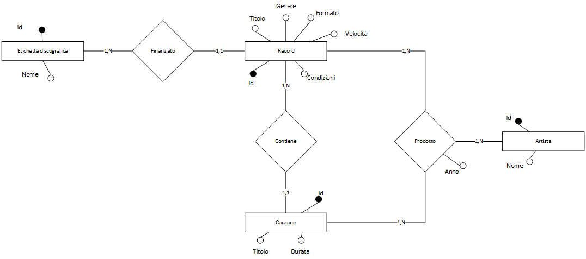

# 🎵 Vinyl Collection Management

> A comprehensive web application for managing your personal vinyl record collection 

[](https://php.net/)
[](https://mysql.com/)
[](https://tailwindcss.com/)

This web application was developed as a final project for the Database and Web course at the University of Parma, supervised by Professor S. Cagnoni. Built with **PHP** and **MySQL**, this platform provides a complete solution for vinyl enthusiasts to catalog, search, and manage their record collections.

## 🌟 Features

- 📀 **Complete Vinyl Management**: View, add, modify, and delete vinyl records from your collection
- 🔍 **Advanced Search**: Search by artist, album title, release year, or individual track names
- 🎤 **Artist Integration**: Fetch artist photos and album artwork using the Last.fm API
- 📊 **Detailed Records**: Store comprehensive information including condition ratings, formats, and personal notes
- 🎵 **Track Listings**: Manage complete tracklists with duration for each song
- 📱 **Responsive Design**: Modern UI built with Tailwind CSS for optimal viewing on any device
- 📄 **Paginated Results**: Efficiently browse large collections with 10 records per page

## 🏗️ Architecture

The application consists of **3 main pages** that provide comprehensive vinyl management functionality:

### 📋 Main Pages

#### 🏠 `index.php` - Collection Dashboard
The main page featuring:
- 🔍 **Search functionality** for albums by title, artist, release year, or track names
- ➕ **Quick add** button for new vinyl records
- 📊 **Complete catalog display** with pagination (10 records per page)
- 🔗 **Clickable records** that navigate to detailed views
- 🔄 **Sorting options** by title, artist, or release year

**URL Parameters:**
- `click`: Page number for pagination navigation
- `param`: Search query parameter
- `order`: Sort order (0=title, 1=artist, 2=year)

#### 📀 `record.php` - Detailed Record View
Comprehensive record management page displaying:
- 📝 **Complete album information** (title, artist, year, genre)
- 💿 **Physical details** (format: 12"/10"/7", speed: 33/45/78 RPM)
- ⭐ **Condition ratings** for both record and sleeve (following [Discogs standards](https://support.discogs.com/hc/en-us/articles/360001566193-How-To-Grade-Items))
- 📝 **Personal notes** and observations
- 🎵 **Complete tracklist** with song titles and durations

**Actions available:**
- ✏️ **Edit record** - Modify any existing information
- 🗑️ **Delete record** - Permanently remove from collection
- 🎵 **Manage tracks** - Add, edit, or remove individual songs

> ⚠️ **Warning**: Record deletion is irreversible and will also remove all associated tracks.

#### ➕ `add-record.php` - Add New Records
User-friendly form for adding new vinyl records with:
- 📝 **Album information** input fields
- 📊 **Condition assessment** dropdowns
- 🎵 **Track management** integration
- 🔗 **Last.fm integration** for artwork and artist data

### 🔧 Supporting Files

| File | Purpose |
|------|---------|
| `database-connection.php` | 🔌 Database credentials and connection functions |
| `functions.php` | 🛠️ Core application functions and SQL queries |
| `index-functions.php` | 🏠 Homepage-specific utilities for search and sorting |
| `lastfm-api.php` | 🎨 Last.fm API integration for artist photos and artwork |
| `modify-record.php` / `modify-songs.php` | ✏️ Record and track editing interfaces |
| `delete-record.php` | 🗑️ Safe record deletion functionality |
| `header.php` / `footer.php` | 🎨 Reusable page layout components |

### 🎨 Design & APIs

- **UI Framework**: [Tailwind CSS](https://tailwindcss.com/) for modern, responsive design
- **External API**: [Last.fm API](https://www.last.fm/api) for artist photos and album artwork

## 🗄️ Database Schema

The application uses a **MySQL database** with **4 interconnected tables** designed to efficiently store and manage vinyl record information:

### 📊 Database Tables

```sql
CREATE TABLE `artists` (
  `id` int(11) NOT NULL AUTO_INCREMENT,
  `name` varchar(255) NOT NULL,
  PRIMARY KEY (`id`)
) ENGINE=InnoDB DEFAULT CHARSET=utf8mb4;

CREATE TABLE `labels` (
  `id` int(11) NOT NULL AUTO_INCREMENT,
  `name` varchar(255) NOT NULL,
  PRIMARY KEY (`id`)
) ENGINE=InnoDB DEFAULT CHARSET=utf8mb4;

CREATE TABLE `records` (
  `id` int(11) NOT NULL AUTO_INCREMENT,
  `title` varchar(255) NOT NULL,
  `artist` int(11) NOT NULL,
  `label` int(11) DEFAULT NULL,
  `year` int(11) DEFAULT NULL,
  `insert_date` datetime DEFAULT current_timestamp(),
  `vinyl_condition` varchar(3) DEFAULT NULL,
  `sleeve_condition` varchar(3) DEFAULT NULL,
  `format` int(2) DEFAULT NULL,
  `speed` int(2) DEFAULT NULL,
  `notes` text DEFAULT NULL,
  `genre` varchar(256) NOT NULL,
  `numberOfSongs` int(11) NOT NULL,
  PRIMARY KEY (`id`),
  FOREIGN KEY (`artist`) REFERENCES `artists` (`id`),
  FOREIGN KEY (`label`) REFERENCES `labels` (`id`)
) ENGINE=InnoDB DEFAULT CHARSET=utf8mb4;

CREATE TABLE `songs` (
  `id` int(11) NOT NULL AUTO_INCREMENT,
  `title` varchar(255) NOT NULL,
  `artist` int(11) NOT NULL,
  `duration` varchar(11) DEFAULT NULL,
  `records` int(11) DEFAULT NULL,
  PRIMARY KEY (`id`),
  FOREIGN KEY (`artist`) REFERENCES `artists` (`id`),
  FOREIGN KEY (`records`) REFERENCES `records` (`id`)
) ENGINE=InnoDB DEFAULT CHARSET=utf8mb4;
```

### 🔗 Relationships

- **One-to-Many**: Each artist can have multiple records and songs
- **One-to-Many**: Each record can have multiple songs
- **One-to-Many**: Each label can publish multiple records
- **Many-to-One**: Each record belongs to one artist and one label



### 💾 Database Setup Files

The `database/` directory contains setup scripts:

- 📁 `database.sql` - **Fresh installation** with empty tables
- 📁 `myvinylcollection.sql` - **Sample data** for testing and demonstration

## 🛠️ Tech Stack

| Component | Technology | Purpose |
|-----------|------------|---------|
| **Backend** |  PHP | Server-side logic and database operations |
| **Database** |  MySQL | Data persistence and management |
| **Frontend** |  Tailwind CSS | Responsive UI design |
| **API Integration** |  Last.fm API | Artist photos and album artwork |
| **Database Management** |  phpMyAdmin | Database administration interface |

## 📋 Requirements

### 🖥️ System Requirements

- **Web Server**: Apache or Nginx
- **PHP**: Version 7.4 or higher
- **Database**: MySQL 5.7+ or MariaDB 10.2+
- **Extensions**: PDO MySQL extension enabled

### 🌐 Recommended Environment

For local development, we recommend using:

- **[XAMPP](https://www.apachefriends.org/)** - Complete development environment
- **[WAMP](http://www.wampserver.com/)** (Windows) - Alternative stack solution
- **[MAMP](https://www.mamp.info/)** (macOS) - Mac-specific solution

### 🔑 External Services

- **[Last.fm API Account](https://www.last.fm/api/account/create)** - Required for artist photos and album artwork

## 🚀 Installation

### 📥 Step 1: Download & Setup

1. **Clone the repository:**
   ```bash
   git clone https://github.com/GiorCocc/VinylCollectionManagement.git
   cd VinylCollectionManagement
   ```

2. **Place in web server directory:**
   - **XAMPP**: Copy to `htdocs/vinyl-collection/`
   - **WAMP**: Copy to `www/vinyl-collection/`
   - **MAMP**: Copy to `htdocs/vinyl-collection/`

### 🗄️ Step 2: Database Setup

1. **Start your web server and MySQL**

2. **Create database using phpMyAdmin:**
   - Open [http://localhost/phpmyadmin](http://localhost/phpmyadmin)
   - Create a new database (e.g., `vinyl_collection`)

3. **Import database structure:**
   ```bash
   # For fresh installation
   mysql -u username -p database_name < database/database.sql
   
   # For installation with sample data
   mysql -u username -p database_name < database/myvinylcollection.sql
   ```

   Or use phpMyAdmin:
   - Select your database
   - Go to "Import" tab
   - Choose `database/database.sql` file
   - Click "Go"

### ⚙️ Step 3: Configuration

1. **Configure database connection:**
   
   Edit `database-connection.php`:
   ```php
   <?php
   $host = 'localhost';        // Database host
   $dbname = 'your_database';  // Your database name
   $username = 'your_user';    // Database username
   $password = 'your_pass';    // Database password
   ?>
   ```

2. **Setup Last.fm API (Optional but recommended):**
   
   - Create account at [Last.fm](https://www.last.fm/api/account/create)
   - Get your API key and secret
   - Edit `lastfm-api.php` and add your API key to each request URL:
   ```php
   $api_key = 'YOUR_API_KEY_HERE';
   ```

### 🎯 Step 4: Access Application

Visit [http://localhost/vinyl-collection/index.php](http://localhost/vinyl-collection/index.php) in your web browser.

## 📱 Usage

### 🏠 Getting Started

1. **Access the main page** at `index.php`
2. **Browse your collection** or use the search functionality
3. **Add your first record** using the "Add New Record" button
4. **Manage existing records** by clicking on any album in the list

### 🔍 Search & Navigation

- **Search by**: Artist name, album title, release year, or song title
- **Sort results**: By title, artist, or release year
- **Pagination**: Browse large collections with 10 records per page

### ➕ Adding Records

1. Click "Add New Record" button
2. Fill in album information (title and artist are required)
3. Set condition grades using Discogs standards
4. Add personal notes if desired
5. Save and optionally add track listings

### ✏️ Managing Records

### ✏️ Managing Records

- **View details**: Click on any record to see complete information
- **Edit**: Use the "Edit" button on the record detail page
- **Delete**: Use the "Delete" button (⚠️ irreversible action)
- **Manage tracks**: Add, edit, or remove individual songs

## 🤝 Contributing

We welcome contributions to improve the Vinyl Collection Management system! Here's how you can help:

### 🛠️ Development Setup

1. **Fork the repository** on GitHub
2. **Clone your fork** locally:
   ```bash
   git clone https://github.com/your-username/VinylCollectionManagement.git
   ```
3. **Create a feature branch**:
   ```bash
   git checkout -b feature/your-feature-name
   ```
4. **Set up development environment** following the installation guide above

### 📝 Contribution Guidelines

- **Code Style**: Follow existing PHP and JavaScript coding patterns
- **Database Changes**: Include migration scripts for any schema modifications
- **Documentation**: Update README and inline comments for new features
- **Testing**: Test thoroughly with different browsers and data scenarios

### 🐛 Reporting Issues

When reporting bugs, please include:
- **Environment details** (PHP version, MySQL version, browser)
- **Steps to reproduce** the issue
- **Expected vs actual behavior**
- **Screenshots** if applicable

### 💡 Feature Requests

Before requesting new features:
- Check existing issues to avoid duplicates
- Describe the problem your feature would solve
- Provide mockups or detailed descriptions when helpful

### 🔄 Pull Request Process

1. **Update documentation** for any new features
2. **Test your changes** thoroughly
3. **Create detailed PR description** explaining your changes
4. **Link related issues** in your PR description

## 📄 License

This project was created as an educational project for the Database and Web course at the University of Parma. 

**Academic Use**: This code is freely available for educational and academic purposes.

**Commercial Use**: Please contact the author for commercial usage permissions.

## 👨‍💻 Author

**Giorgio Cocchiaro**
- 🎓 University of Parma - Database and Web Course
- 👨‍🏫 Supervised by Professor S. Cagnoni

## 🙏 Acknowledgments

- **Professor S. Cagnoni** - Course supervision and guidance
- **University of Parma** - Educational support
- **[Last.fm](https://www.last.fm/)** - API for artist photos and album artwork
- **[Discogs](https://www.discogs.com/)** - Condition grading standards
- **[Tailwind CSS](https://tailwindcss.com/)** - Styling framework

## 📚 Additional Resources

### 🔗 Useful Links

- **[Discogs Grading Guide](https://support.discogs.com/hc/en-us/articles/360001566193-How-To-Grade-Items)** - Learn about vinyl condition standards
- **[Last.fm API Documentation](https://www.last.fm/api)** - Integrate music data
- **[PHP Manual](https://www.php.net/manual/)** - PHP development reference
- **[MySQL Documentation](https://dev.mysql.com/doc/)** - Database administration guide

### 📖 Related Documentation

- `Documentazione.pdf` - Complete Italian documentation (included in repository)
- Database schema diagrams in `resources/Documentazione/`

---

<div align="center">

**🎵 Happy collecting! 🎵**

Made with ❤️ for vinyl enthusiasts

[](https://github.com/GiorCocc/VinylCollectionManagement)

</div>
